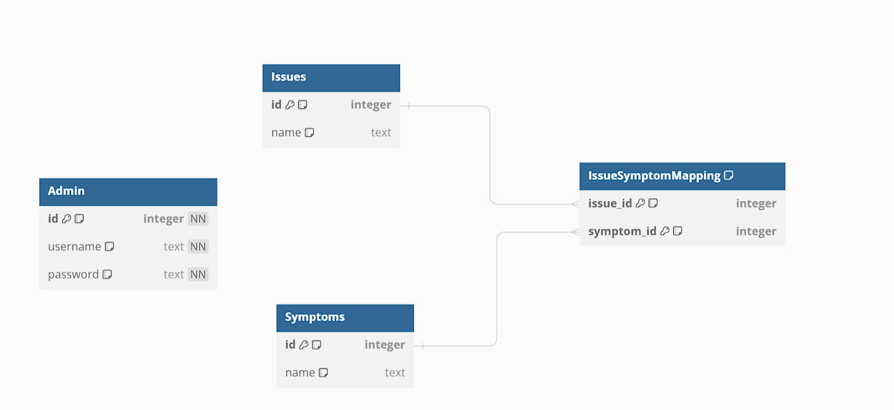

# Computer Diagnostic Expert System


## Introduction

This project implements a Computer Diagnostic Expert System, which assists users in diagnosing computer hardware issues based on observed symptoms. The system allows users to input symptoms and then generates a questionnaire for further precision in identifying the faulty hardware component. Once the questionnaire is completed, the system displays the faulty component, along with other potentially affected components.


## Features

#### User Session

- Provides a user-friendly interface for accessing the application.

Allows users to:

- Input symptoms through an easy-to-use form.
- Manipulate entered facts (symptoms) if necessary.
- Deduces hardware issues based on entered symptoms.

#### Expert Session

- Offers an interface for experts to access the application.
- Recognizes experts via login credentials to allow manipulation of the rule base.

Allows experts to:

- Authenticate
- Add/update/delete a symptom
- Add/update/delete an issue (faulty component)

#### Security measures

- Authentication & Authorization using JWT (json web tokens)
- Protected routes
- Proteced apis using middlewares

## Implementation Details

#### Knowledge Representation

The knowledge is represented using a rule-based system. Rules define relationships between symptoms and hardware issues.



#### Reasoning Type and Strategy

The system employs `forward chaining` reasoning to deduce hardware issues based on input symptoms. This strategy allows the system to determine the faulty component by matching input symptoms with predefined rules.

## Technology Stack

- Frontend: React with TypeScript and Tailwind CSS for the user interface.
- Backend: Node.js with Express for server-side logic.
- Database: SQLite for storing user inputs and expert rules.

## Usage

1. Clone the repository:

```bash
git clone https://github.com/y4riss/expertsystem.git
cd expertsystem
```

2. Install dependencies:

```bash
cd frontend && npm install
cd ../backend && npm install

```

3. Start the backend server:

```bash
cd backend
npm run dev
```

4. Start the frontend application

```bash
cd ../frontend
npm start
```

5. Access the application

| http://localhost:5173/


## Admin page

#### Default creds

```yaml
    username: admin
    password: admin
```

#### Login portal

| http://localhost:5173/login

#### Dashboard

| http://localhost:5173/dashboard

#### Api routes

- GET REQUEST
  
| http://localhost:3000/api/rules/issues

| http://localhost:3000/api/rules/symptoms

- POST REQUEST

| http://localhost:3000/api/auth/login

| http://localhost:3000/api/auth/logout

| http://localhost:3000/api/rules/issue

| http://localhost:3000/api/rules/symptom

| http://localhost:3000/api/diagnosis

- PUT / DELETE REQUEST

| http://localhost:3000/api/rules/issue/:id

| http://localhost:3000/api/rules/symptom/:id


